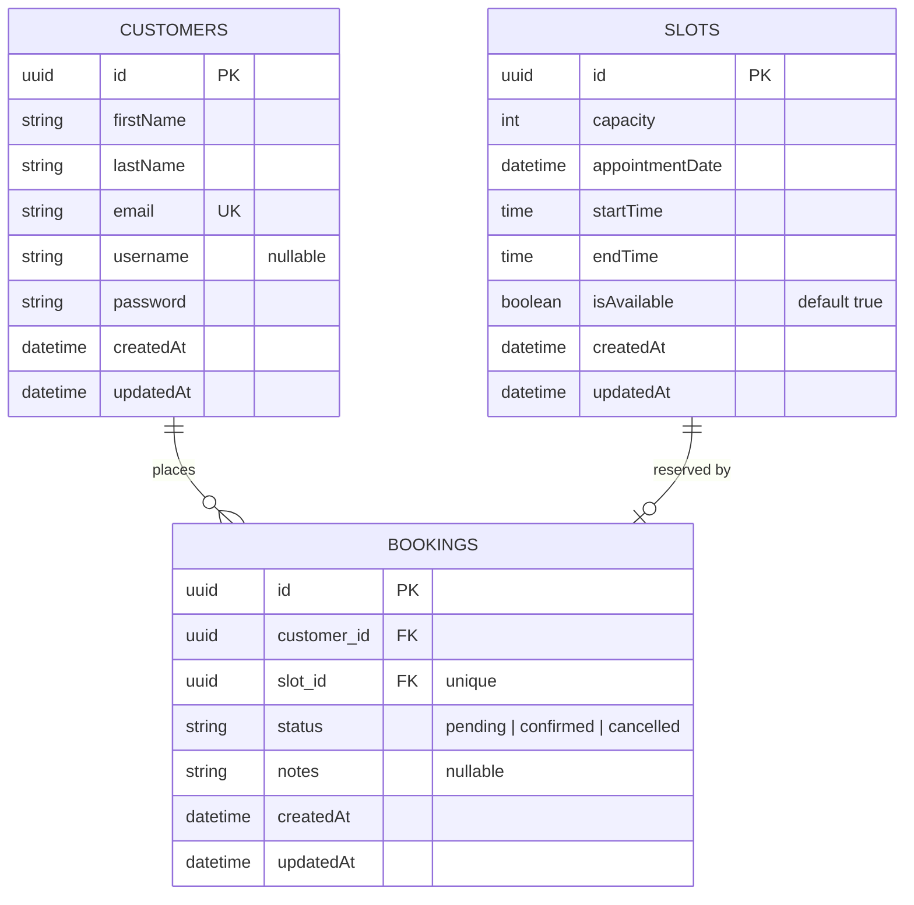

# Day 1 — Baselines & Project Setup

Source: `ethanpatrickbandebas-training-plan.html` — Mon · W1 · Day 1

## Activities (all required today, per the plan)

- [x] Skill IQ baseline — TypeScript
- [x] Skill IQ baseline — React 18
- [x] Skill IQ baseline — Next.js 14
- [x] Skill IQ baseline — SQL Essentials
- [x] `api.queue-booking` repo scaffolded (NestJS + TypeORM, Next.js, SQL Server Dev Edition) — PR-only, branch protection on ([PR #1](https://github.com/ebandebasfs/2-week-training-plan/pull/1))
- [x] Seed data: customers / slots / bookings (10 / 15 / 8 via Faker — `npm run seed`)

Note: Skill IQ baselines must be taken **before opening any course material**. Repo scaffold is timeboxed to 2h; overflow carries to Day 2 morning.

## Deliverable (per the plan's Deliverable box — sent to EM in the EOD email)

- [x] Skill IQ baseline scores (×4)
- [x] Repo link ([PR #1](https://github.com/ebandebasfs/2-week-training-plan/pull/1))
- [x] Schema diagram in README

## Schema diagram

Added to `api.queue-booking/README.md` (Schema section) as a Mermaid ER diagram, generated from the actual entities:

- Customer → Booking: one-to-many (`customer_id` required, not unique)
- Slot → Booking: one-to-one (`slot_id` required and unique — this is the double-booking safety net at the schema level)

Source: `api.queue-booking/src/db/entities/*.entity.ts` + `1785491153757-InitSchema.ts`.

## EOD email

Use `email.md` in this folder — copy its contents into the EOD submission per the Deliverable Email Template.
