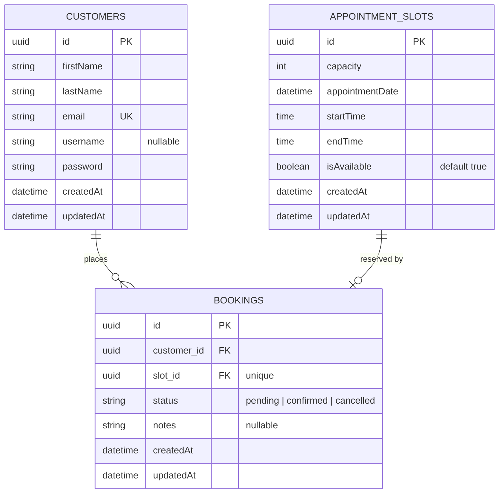

# Day 1 — Baselines & Project Setup

Source: `ethanpatrickbandebas-training-plan.html` — Mon · W1 · Day 1

## Deliverable checklist

- [ ] Skill IQ baseline — TypeScript 
- [ ] Skill IQ baseline — React 18
- [ ] Skill IQ baseline — Next.js 14
- [ ] Skill IQ baseline — SQL Essentials
- [ ] EM-led baseline: 2-min intro video (one-sentence-first)
- [ ] `queue-booking` repo scaffolded (NestJS + TypeORM, Next.js, SQL Server Dev Edition) — PR-only, branch protection on
- [ ] Seed data: customers / slots / bookings
- [ ] Schema diagram in README

Note: Skill IQ baselines must be taken **before opening any course material**. Repo scaffold is timeboxed to 2h; overflow carries to Day 2 morning.

## Schema diagram

Added to `queue-booking/README.md` (Schema section) as a Mermaid ER diagram, generated from the actual entities:

- Customer → Booking: one-to-many (`customer_id` required, not unique)
- AppointmentSlot → Booking: one-to-one (`slot_id` required and unique — this is the double-booking safety net at the schema level)

## EOD email

Use `email.md` in this folder — copy its contents into the EOD submission per the Deliverable Email Template.
